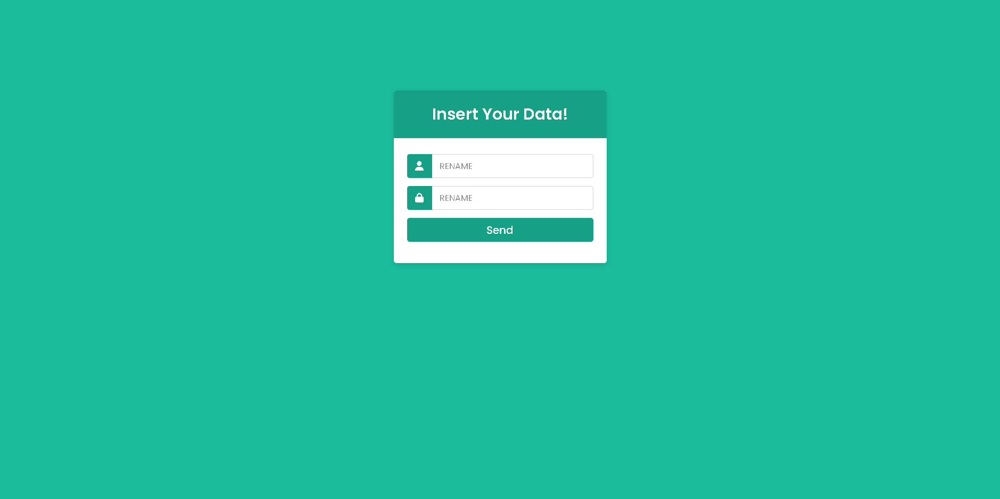

# HTML-CSS-Form-Template

Hate form creation for your website? Look no further!

## Why Choose This Template?

- **User-Friendly:** Simplify the form creation process with intuitive design.
- **Seamless Integration:** Effortlessly blends into your website, ensuring a elegance look.

## Features

- **Clean and Organized Structure:** HTML layout designed for clarity and simplicity.
- **Modern Styling:** CSS design with a touch of professionalism for an aesthetically pleasing form.
- **Responsive Layout:** Ensures compatibility across various devices for a seamless user experience.

## How to Use

1. Copy both the HTML and CSS file.
2. Easily customize form fields to tailor it to your specific requirements.
3. Effortlessly integrate it into your website to enhance user interaction.

## Easy Customization: Tweak colors, fonts, and styles to match your website's theme.

### Browser compatibility ###

The code should work fine on the following browsers:

* Firefox 3.5+
* Google Chrome
* Opera 12+
* IE9+
* Safari 6+

  
### Building ###
You can download ready builds [here](https://github.com/TheDevsIsHere/HTML-CSS-Form-Magic/releases/).

Clone git repository:

    $ git clone https://github.com/TheDevsIsHere/HTML-CSS-Form-Magic.git

Build browser bundle

    $ npm run build

## Results

Immerse yourself in the simplicity and elegance of this HTML page template with CSS styling.

